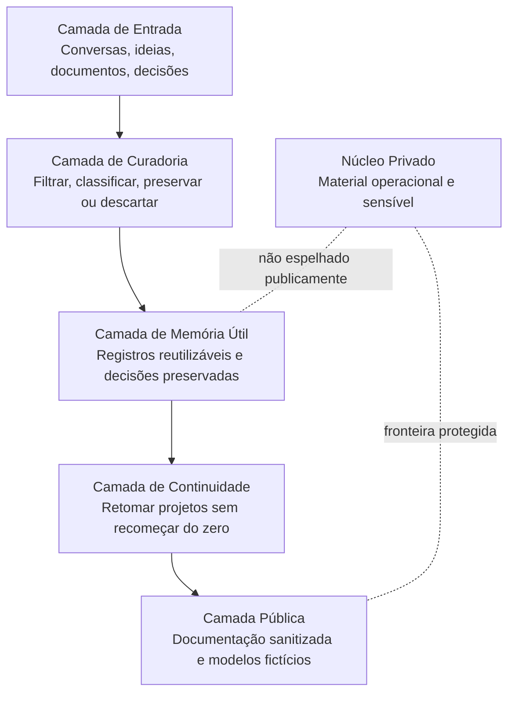
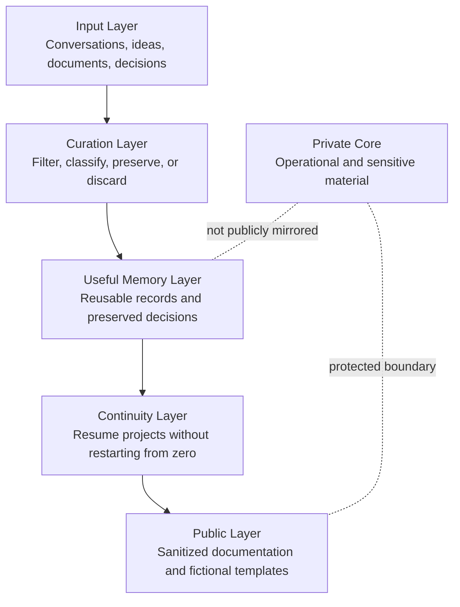

# Diagrama da Arquitetura Pública / Public Architecture Diagram

[Português](#português) | [English](#english)

---

## Português

Este diagrama apresenta uma visão segura e pública da arquitetura conceitual do Cérebro Tendoshk.

Ele não representa a implementação privada completa e não expõe mecanismos internos sensíveis.

### Leitura do diagrama

- A camada de entrada recebe materiais brutos.
- A camada de curadoria decide o que tem valor durável.
- A camada de memória útil organiza o que pode apoiar retomadas futuras.
- A camada de continuidade protege o fio de projetos vivos.
- A camada pública mostra apenas documentação sanitizada.
- O núcleo privado permanece separado por design.

---

## English

This diagram presents a safe public view of the Cérebro Tendoshk conceptual architecture.

It does not represent the complete private implementation and does not expose sensitive internal mechanisms.

### How to read the diagram

- The input layer receives raw material.
- The curation layer decides what has durable value.
- The useful memory layer organizes what can support future resumption.
- The continuity layer protects the thread of living projects.
- The public layer shows only sanitized documentation.
- The private core remains separated by design.
